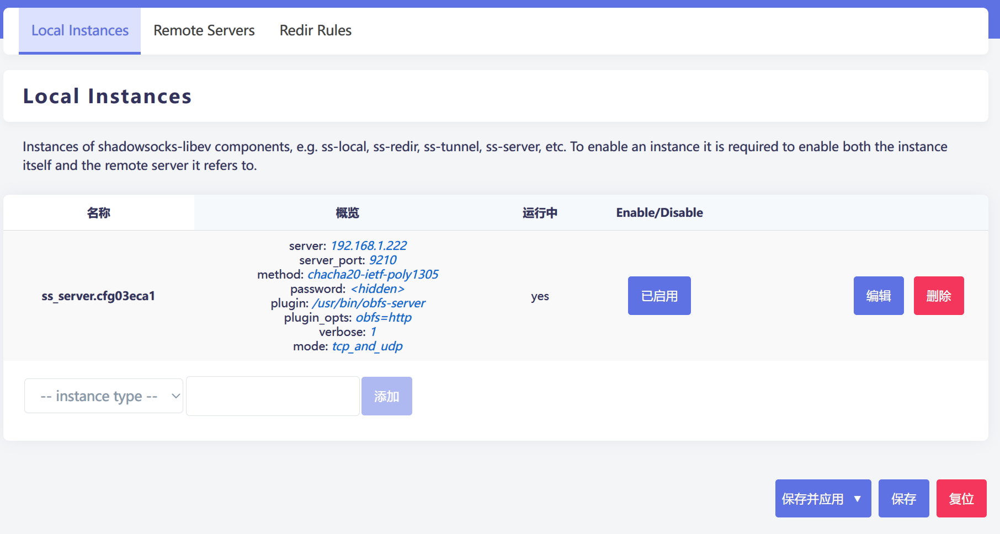
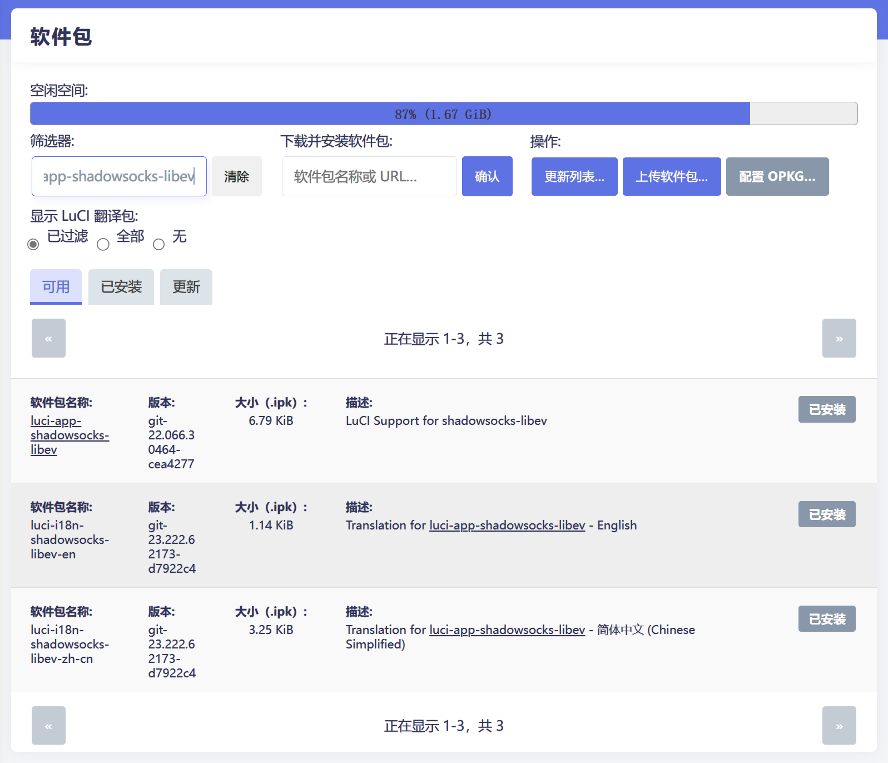
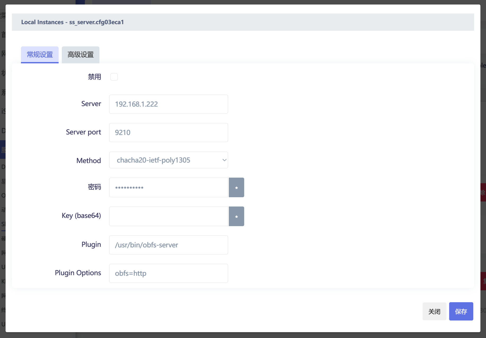

%%
> [!example]+ **Comments**    
>  | Date___ | Comments |
> | ------- | -------- |
> 
>  **Comment**:: 
%%

# 如何在 Openwrt（iStoreOS）上安装 Shadowsocks 以及其混淆服务

## 需求

本来是想通过 openclash 的socks代理给外网设备提供代理服务器，然后在网上搜集资料的过程中发现这个socks代理是明文传输的，所以就想换个方式去达到这个代理的需求，于是就想到用 shadowsocks 服务器，然后通过clash meta 的 配置预处理的方式手动添加一个ss节点，来实现代理上网。顺便我也发现可以通过这个方式也能够直接输入ip地址访问家里局域网里的其他设备，所以一举两得

## 准备工作

- openWRT（实际情况使用的是 [iStoreOS](iStoreOS.md) ）
    - 路由器是作为旁路由组在家庭网络里。网络配置基本保持iStoreOS 旁路由模式默认配置
    - 装了一个 openclash 用于科学上网
- 能够访问 openwrt 的软件库，我用的是清华的镜像（iStoreOS 默认）
- `obfs-server` 的 ipk 包，在 [openwrt-dist 的 SourceForge Archive](https://openwrt-dist.sourceforge.net/archives/simple-obfs/0.0.5-4/current/) 里面可以找到。这个清华镜像里没有找到，所以要手动上传安装
- 客户端任意支持 shadowsocks 的客户端。文中我用的是 clash-verge。

## 安装 shadowsocks-libev

在 OpenWrt 上的话建议安装 shadowsocks-libev ，占用的资源比较小。shadowsocks-libev 在OpenWrt 的软件仓库里就有。直接搜索安装 `shadowsocks-libev-ss-server` 。


shadowsocks-libev 其实还有 `redir` 、`local` 、`rules` 、`tunnel` 等软件包，但是如果你不需要通过 shadowsocks-libev 科学上网的话，就不需要安装。然后我们再安装 shadowsocks 的 LuCI 界面，查找 `luci-app-shadowsocks-libev` 并安装：



安装好之后重载页面，你就可以在 `服务` 选项卡里找到 shadowsocks-libev。

## 安装 obfs-server

到 [openwrt-dist 的 SourceForge Archive](https://openwrt-dist.sourceforge.net/archives/simple-obfs/0.0.5-4/current/) 下载对应版本的 ipk 包。软路由就选 `x86_64` 。然后到路由其上的软件包页面上传软件包安装即可。

安装完毕之后， ssh 进路由器的 console，用 which 命令查询 `obfs=server` 的文件路径：

```bash
which obfs-server
```

## 配置 Shadowsocks

进入路由器的 shadowsocks-libev 配置界面，删除和 server 无关的所有 instances。然后进入默认的 server instance 的编辑界面，输入 shadowsocks 服务器的基本信息。



Server 我输入的是路由器的局域网 IP，因为我公网设备访问 ss 的时候是通过主路由端口转发，所以并不需要监听所有地址。端口、密码与 Method 任意，需要注意的是 plugin 一定要写 `obfs-server` 二进制文件的绝对路径，也就是之前 `which` 命令查询到的路径。如果有SSL证书的话可以用 `obfs=tls` 参数，会更加安全。

保存配置后应用配置，启用 server，看到运行中出现 `yes` 即可。


## 配置clash

根据 clash meta 的 `proxies` 配置样例进行配置：

```yaml
proxies:
  - name: "home"
    type: ss
    server: home.example.com
    port: 9210
    cipher: chacha20-ietf-poly1305
    password: "password"
    udp: true
    udp-over-tcp: false
    udp-over-tcp-version: 2
    ip-version: ipv4
    plugin: obfs
    plugin-opts:
      mode: http
      host: bing.com
    smux:
      enabled: false
```

然后把 clash-verge 的模式切换成全局模式，使用 `home` 节点，测试一下网络是否配置成功。

## 进一步进行规则配置

由于我的外网设备所处的网络环境有相当多的国内网址被屏蔽，所以针对这些网站走家里路由器进行上网。因为 clash meta 支持 geosite ，所以可以方便地进行规则配置：

```yaml
prepend-rules: 
  - GEOSITE,taobao,YYYY
  - GEOSITE,zhihu,YYYY
  - GEOSITE,xiaohongshu,YYYY
  - IP-CIDR,192.168.1.0/24,home # 访问家里局域网设备走home

prepend-proxy-groups:
  - name: YYYY
    type:select
    proxies: 
      - Domestic
      - home
      - Proxy
      - DIRECT
```

# Reference

- **创建日期**:: [2023-09-09](2023-09-09.md)
- **Source**:: 