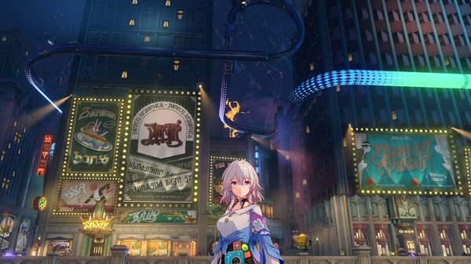

%%
> [!example]- **Comments:** 这篇文章很少见地考察了逆未来风格的游戏的历史，有参考价值    
>  | Date___ | Comments |
> | ------- | -------- |
> 
>  **Comment**:: 这篇文章很少见地考察了逆未来风格的游戏的历史，有参考价值
%%

# 『崩壊：スターレイル』新たな舞台「ピノコニー」のキーワードは “夢”。現実で叶わぬ幻想を描く、レトロフューチャーの世界【ゲームで世界を観る 特別編】

《崩壊:スターレイル》是由HoYoverse制作的一款适用于PS5/PC/iOS/Android平台的RPG游戏。在2月6日，游戏使用了2.0版本更新，引进了一个新的场景——“ピノコニー”。这个地方曾是公司的监狱，现在则被叫做“ファミリー”的派系统治。游戏中有一个丰富多彩的设置，包括一个被称为“梦境”的神奇世界。玩家会遇到各种迷你游戏，在这些游戏中，他们可以探索诸如错视谜题般的奇妙现象。游戏的设计主题是“レトロフューチャー”，是一种未来主义的风格，让人联想到约100年前的巴黎和纽约。《崩壊:スターレイル》版本2.0已经在所有平台上线，并且基础游戏免费供玩家享受。

>[!metadata] Metadata
> - **原始链接**:: [Original Link](https://www.gamespark.jp/article/2024/02/06/138213.html)
> - **标注编辑**:: [简悦标注](<http://localhost:7026/unread/713>)
> - **外部链接**:: [外部链接](https://jolly-paprenjak-b01ad6.netlify.app/)

%% End Metadata %%

## Annotations
> [!quote]+ Highlight 2024-02-13T21:13:38.017+08:00 
> そういった「レトロフューチャー」のイメージは、人々が享楽を謳歌していたフランスの「ベルエポック」と、アメリカの「ジャズエイジ」という二つの時代をミックスしたデザインで描かれています。第一次世界大戦を境に前後するものの、どちらも文化芸術が花開いた特異な時代でした。
> ^sran-1707830018017

> [!quote]+ Highlight 2024-02-13T21:21:08.332+08:00 
> 新しい技術で上書きされるほど、かつての想像図とのギャップは広がり、やがて「実現しなかった古い想像図」になります。そのズレを楽しむのがレトロフューチャーなのです。
> ^sran-1707830468332

> [!quote]+ Highlight 2024-02-13T21:21:25.117+08:00 
> ベルエポックではそれに呼応するように、芸術家は「死」「エロス」といった旧来のキリスト教的価値観で忌避されてきた領域に踏み込みます。この傾向を**「デカダンス（退廃）」**と言い、不穏や不気味な雰囲気の作品が生まれました。
> ^sran-1707830485117

> [!quote]+ Highlight 2024-02-13T21:21:49.366+08:00 
> 女性の前に置かれているお酒は「アブサン」で、ニガヨモギなどを使ったハーブ系リキュールです。角砂糖で甘くする飲み方が人気で、価格も安く手に入れやすいため上流から貧乏芸術家まで一世を風靡しました。
> 
> しかし、アブサンは飲み過ぎると幻覚などの中毒症状を引き起こすため、心身を崩す人が後を絶ちませんでした。原因はハーブの成分とも、強過ぎる度数によるアルコール中毒ともされますが、一部の国で販売禁止を命じるほどの社会問題を引き起こしたのです（現在では成分を調整して復活させたものが販売されています）。
> ^sran-1707830509366

> [!quote]+ Highlight 2024-02-13T21:22:13.426+08:00 
> 20 年以上にわたって芸術と科学技術が大きく進歩したフランスの「ベルエポック」は第一次世界大戦によって幕を下ろし、戦後の繁栄によってアメリカを彩った「ジャズエイジ」は大恐慌によって終焉を迎えました。日本で言えばバブル崩壊のようなものでしょうか**。破滅が近づくのを見て見ぬ振りをして踊り続ける……** その代償がどれほど大きいものかは言うまでも無いでしょう。夢から覚めたとき、結局目を逸らしていたに過ぎないと気付くのです。
> ^sran-1707830533426

%% Update: 2024-02-13T21:23:24.699+08:00 %%
%% End Annotations %%

